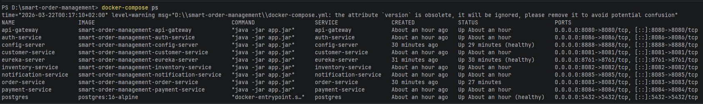
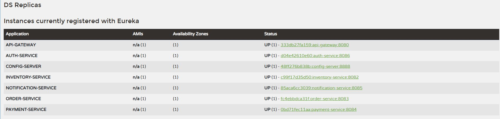
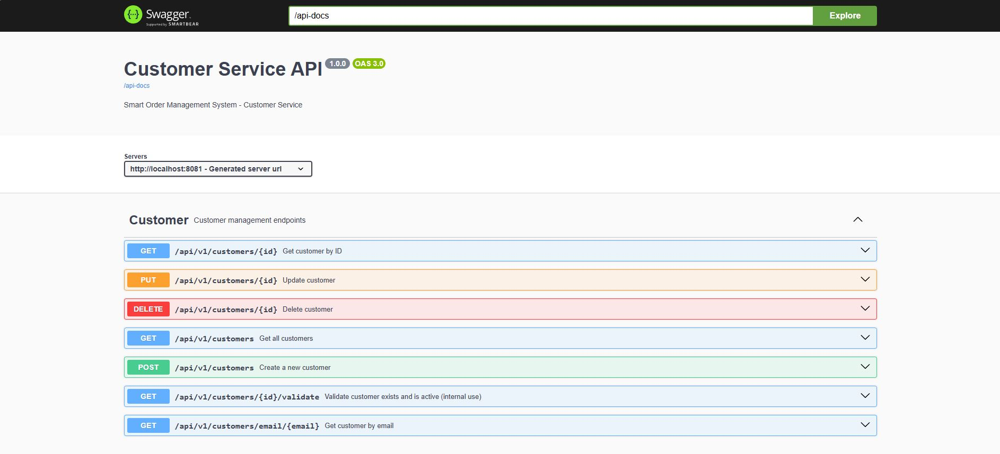
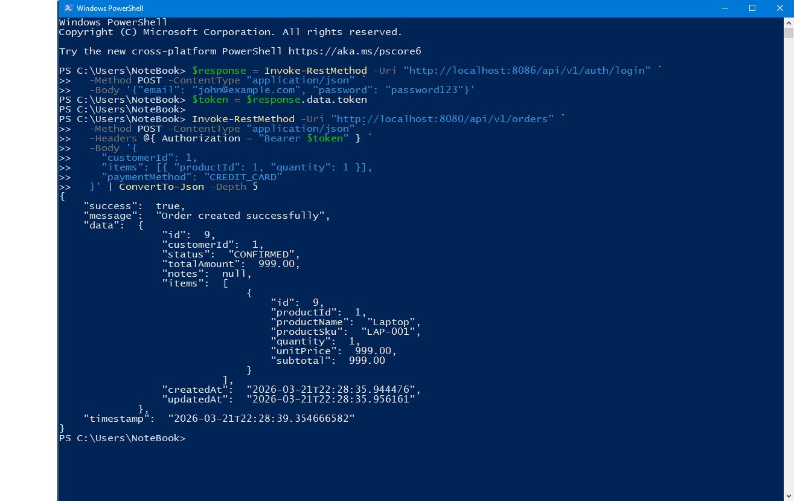

<div align="center">

# 🛒 Smart Order Management System

### Production-style Spring Boot Microservices Backend

[](https://openjdk.org/)
[](https://spring.io/projects/spring-boot)
[](https://spring.io/projects/spring-cloud)
[](https://www.postgresql.org/)
[](https://www.docker.com/)
[](https://jwt.io/)

A complete backend system where customers place orders, the system validates stock,
processes payments, and sends notifications — all secured with JWT and 
fully containerized with Docker.

**Source code available upon request for verified employers.**  
📧 abdelrahman.heissa1@gmail.com | [LinkedIn](https://www.linkedin.com/in/abdulrahman-hassan-b60110203 )

</div>

---

## 📸 Screenshots

### All 9 Services Running in Docker


### Eureka Service Registry — All Services Registered


### Swagger UI — Customer Service API


### Order Confirmed — Full Flow Response


---

## 🏗️ Architecture
```
                    ┌─────────────────────┐
                    │     API Gateway      │  :8080
                    │   (JWT Validation)   │
                    └──────────┬──────────┘
                               │
        ┌──────────────────────┼─────────────────────┐
        │                      │                     │
┌───────▼──────┐     ┌─────────▼──────┐    ┌────────▼────────┐
│ Auth Service │     │Customer Service│    │Inventory Service│
│    :8086     │     │    :8081       │    │    :8082        │
└──────────────┘     └────────────────┘    └─────────────────┘
                               │
        ┌──────────────────────▼──────────────────────┐
        │               Order Service                  │
        │                  :8083                       │
        │    Customer → Stock → Payment → Notify       │
        └──────────┬──────────────────┬───────────────┘
                   │                  │
        ┌──────────▼──────┐  ┌────────▼────────────┐
        │ Payment Service │  │ Notification Service │
        │    :8084        │  │      :8085           │
        └─────────────────┘  └─────────────────────┘

Infrastructure:
├── Eureka Server    :8761  — Service discovery
├── Config Server    :8888  — Centralized configuration  
└── PostgreSQL       :5432  — 6 isolated databases
```

---

## ✨ Key Features

- **9 Microservices** — each with its own database and responsibility
- **JWT Security** — validated at the gateway, not in every service
- **Circuit Breakers** — Resilience4j protects against cascading failures
- **Service Discovery** — Eureka handles dynamic service registration
- **Centralized Config** — Spring Cloud Config Server for all services
- **Full Docker Support** — single command to run the entire system
- **Swagger Docs** — auto-generated API documentation per service
- **Unified Response Format** — consistent success/error responses system-wide

---

## 🔄 Business Flow
```
1.  POST /api/v1/auth/register    → Get JWT token
2.  POST /api/v1/customers        → Create customer profile  
3.  POST /api/v1/products         → Add product with stock
4.  POST /api/v1/orders           → Place order
         │
         ├── Validate customer exists and is ACTIVE
         ├── Check product availability
         ├── Create order → status: PENDING
         ├── Reserve inventory stock
         ├── Process payment
         │       ├── SUCCESS → status: CONFIRMED
         │       │           → stock CONSUMED
         │       │           → notification sent ✅
         │       └── FAILED  → status: FAILED
         │                   → stock RELEASED
         │                   → notification sent ❌
         └── Return final order response
```

---

## 🛠️ Tech Stack

| Layer | Technology |
|---|---|
| Language | Java 21 |
| Framework | Spring Boot 3.3.5 |
| Service Discovery | Spring Cloud Netflix Eureka |
| API Gateway | Spring Cloud Gateway (WebFlux) |
| Configuration | Spring Cloud Config Server |
| Inter-service Calls | OpenFeign |
| Fault Tolerance | Resilience4j (Circuit Breaker + Retry) |
| Security | Spring Security + JWT (JJWT 0.12.6) |
| Database | PostgreSQL 16 — one per service |
| ORM | Spring Data JPA + Hibernate 6 |
| Containerization | Docker + Docker Compose |
| API Docs | SpringDoc OpenAPI + Swagger UI |
| Build | Maven |

---

## 📦 Services

| Service | Port | Database | Responsibility |
|---|---|---|---|
| Eureka Server | 8761 | — | Service registry |
| Config Server | 8888 | — | Centralized config |
| API Gateway | 8080 | — | Routing + JWT validation |
| Auth Service | 8086 | auth_db | Register, login, JWT |
| Customer Service | 8081 | customer_db | Customer management |
| Inventory Service | 8082 | inventory_db | Products + stock |
| Order Service | 8083 | order_db | Order orchestration |
| Payment Service | 8084 | payment_db | Payment processing |
| Notification Service | 8085 | notification_db | Notifications |

---

## 🚀 Quick Start

### Prerequisites
- Java 21
- Maven 3.9+
- Docker Desktop

### Run with Docker
```bash
# 1. Clone the repository
git clone https://github.com/yourusername/smart-order-management.git
cd smart-order-management

# 2. Build all services
for service in eureka-server config-server api-gateway auth-service \
  customer-service inventory-service order-service \
  payment-service notification-service; do
  cd $service && mvn clean package -DskipTests && cd ..
done

# 3. Start everything
docker-compose up -d

# 4. Wait ~2 minutes then verify at http://localhost:8761
```

---

## 📡 API Examples

### Register and get token
```bash
curl -X POST http://localhost:8080/api/v1/auth/register \
  -H "Content-Type: application/json" \
  -d '{"firstName":"John","lastName":"Doe",
       "email":"john@example.com","password":"password123"}'
```

### Place an order
```bash
curl -X POST http://localhost:8080/api/v1/orders \
  -H "Content-Type: application/json" \
  -H "Authorization: Bearer <token>" \
  -d '{"customerId":1,"items":[{"productId":1,"quantity":2}],
       "paymentMethod":"CREDIT_CARD"}'
```

### Successful order response
```json
{
  "success": true,
  "message": "Order created successfully",
  "data": {
    "id": 1,
    "customerId": 1,
    "status": "CONFIRMED",
    "totalAmount": 1999.98,
    "items": [
      {
        "productId": 1,
        "productName": "Laptop",
        "quantity": 2,
        "unitPrice": 999.99,
        "subtotal": 1999.98
      }
    ],
    "createdAt": "2026-03-21T22:13:53"
  },
  "timestamp": "2026-03-21T22:13:54"
}
```

---

## 🔒 Security Design

- JWT generated by Auth Service, validated at API Gateway
- Downstream services never validate tokens — they trust the gateway
- User context forwarded via headers: `X-User-Id`, `X-User-Email`, `X-User-Role`
- Passwords hashed with BCrypt
- Stateless — no sessions

---

## ⚡ Fault Tolerance

Circuit breakers on all Order Service downstream calls:
```
Customer Service down → circuit opens → order fails gracefully
Inventory Service down → circuit opens → order fails gracefully  
Payment Service down → circuit opens → stock released → order fails gracefully
```

Auto-recovery: circuit transitions OPEN → HALF_OPEN → CLOSED when service recovers.

---

## 📁 Package Structure

Every service follows the same structure:
```
com.smartorders.<service>/
├── common/       BaseResponse<T>, ErrorResponse
├── config/       Spring configuration beans
├── controller/   REST endpoints
├── client/       Feign clients (order-service)
├── dto/          Request/Response objects
├── entity/       JPA entities
├── enums/        Status enums
├── exception/    Custom exceptions + GlobalExceptionHandler
├── mapper/       Entity ↔ DTO conversion
├── repository/   Spring Data JPA interfaces
└── service/      Business logic interfaces + implementations
```

---

## 🗺️ Project Phases

| Phase | What was built |
|---|---|
| 1 | Eureka, Config Server, Gateway, Customer, Inventory, Order |
| 2 | Payment Service, Notification Service, complete order flow |
| 3 | Auth Service, Spring Security, JWT gateway filter |
| 4 | Docker Compose, multi-profile config, CORS, containerization |
| 5 | Resilience4j circuit breakers, retry logic, fault tolerance |

---

## 🔮 Future Improvements

- [ ] Async notifications via RabbitMQ / Kafka
- [ ] Role-based access control (ADMIN vs CUSTOMER)
- [ ] Flyway database migrations
- [ ] Distributed tracing with Zipkin
- [ ] Rate limiting at the gateway
- [ ] Real payment gateway (Stripe)
- [ ] Frontend (React / Next.js)
- [ ] Cloud deployment (AWS ECS / DigitalOcean)
- [ ] Spring Boot Admin monitoring dashboard

---

## 📬 Contact

Interested in the source code or working together?

📧 abdelrahman.heissa1@gmail.com  
💼 [LinkedIn](https://www.linkedin.com/in/abdulrahman-hassan-b60110203)  

---

<div align="center">
Built with ☕ Java and a lot of debugging
</div>
